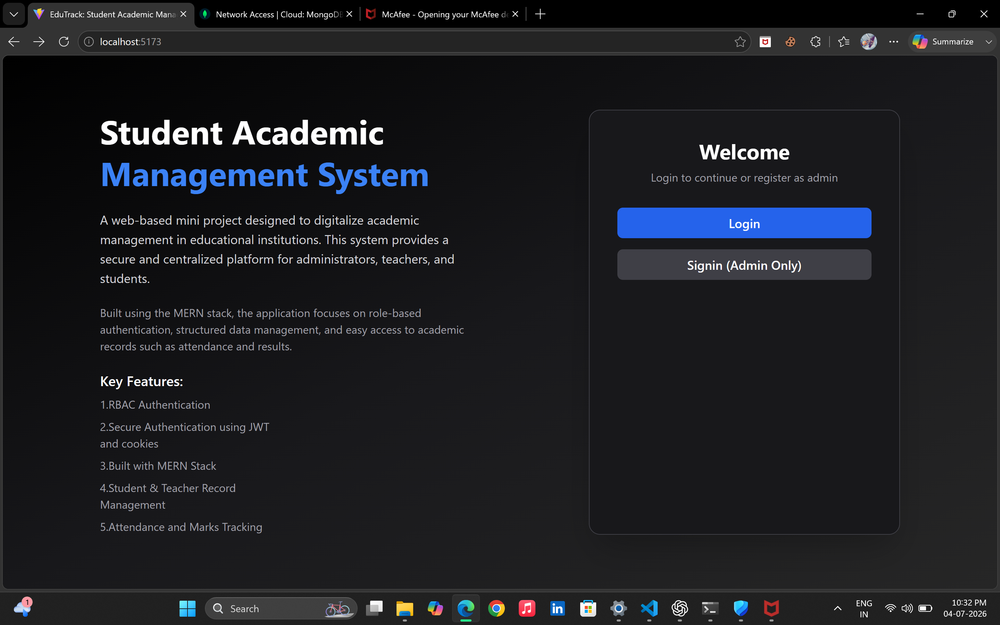
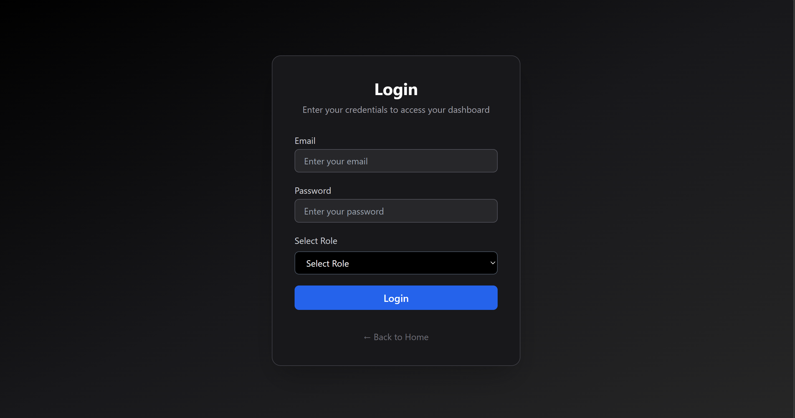
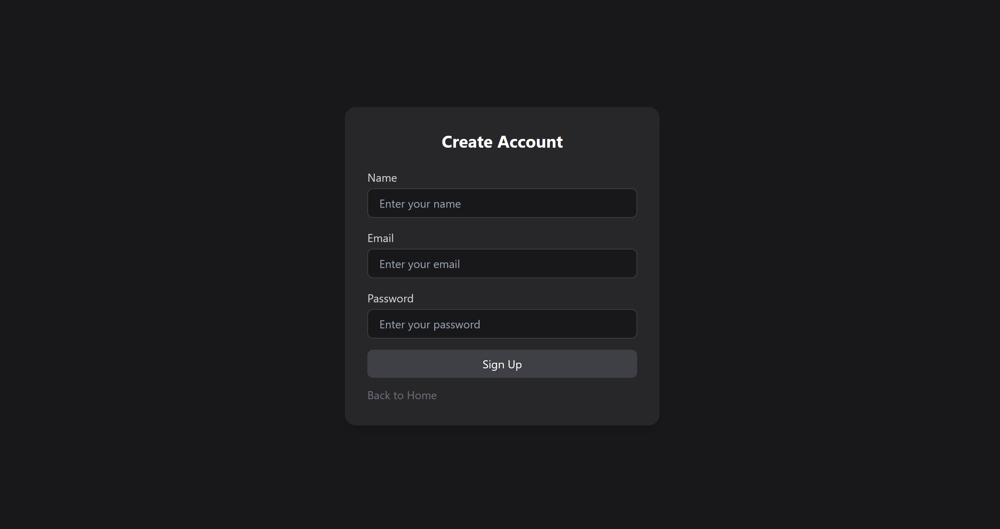
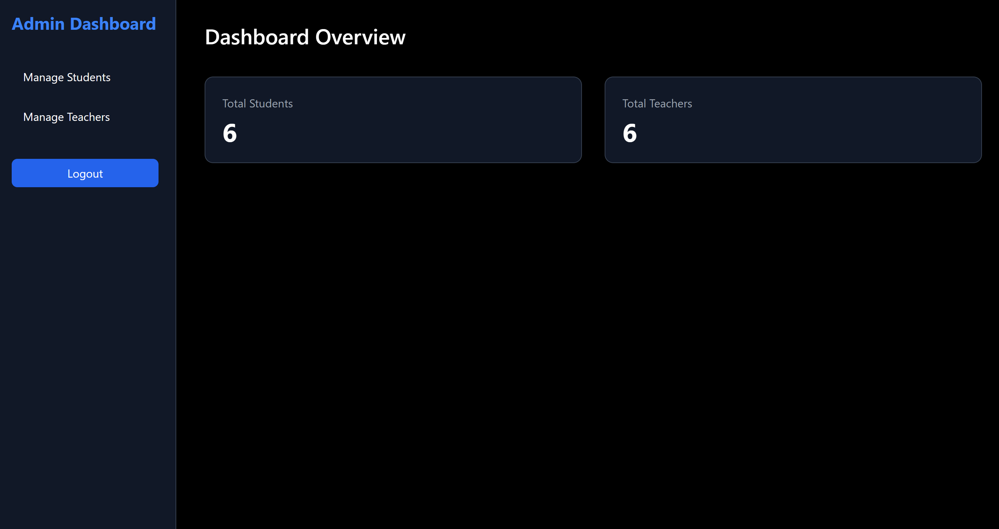
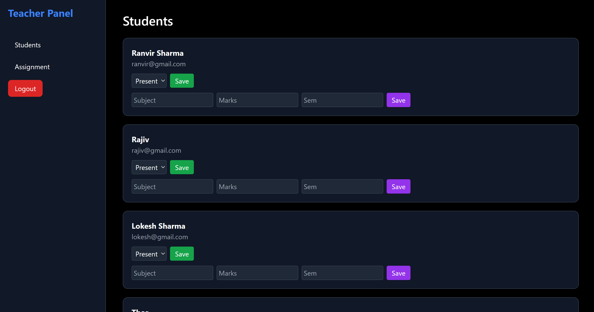
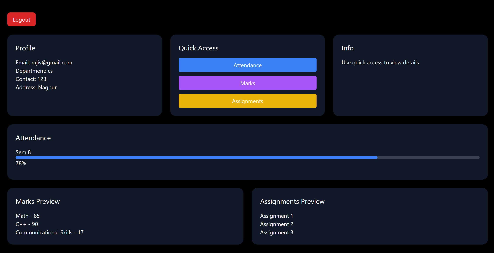

## EduTrack - Student Academic Management System

EduTrack is a full-stack Student Academic Management System developed using the MERN Stack. The application simplifies academic administration by providing dedicated dashboards for Admin, Teachers, and Students with secure role-based authentication.

## FEATURES:-
1.Admin
Secure Login
Dashboard Overview
Add Student
Update Student
Delete Student
Add Teacher
Update Teacher
Delete Teacher
Manage Academic Years

2.Teacher
Teacher Login
View Students
Mark Attendance
Create Assignments
Assign Assignment to Entire Class
Add Student Marks

3.Student
Student Login
Dashboard
View Attendance
View Assignments
View Marks
Academic Overview

## TECH-STACK:-
1.Frontend
React.js
Tailwind CSS
Axios
React Router

2.Backend
Node.js
Express.js
JWT Authentication
bcrypt
RBAC

3.Database
MongoDB Atlas
Mongoose

## PROJECT STRUCTURE:-
EduTrack
│
├── backend
│
├── frontend
│
├── assets
│
└── README.md

## SCREENSHOTS:-
1.Home Page

2.Login Page

3.Signup Page

4.Admin Dashboard

5.Teacher Dashboard

6.Student Dashboard

## AUTHENTICATION:-
JWT Authentication
Cookie-based Login
Protected Routes
Role-based Authorization

## FUTURE SCOPE:-
Dynamic Attendance Analytics
Student Performance Graphs
PDF Report Generation
Notifications
Online Exams
Leave Management
Fee Payment Gateway
Exam-Form Registration